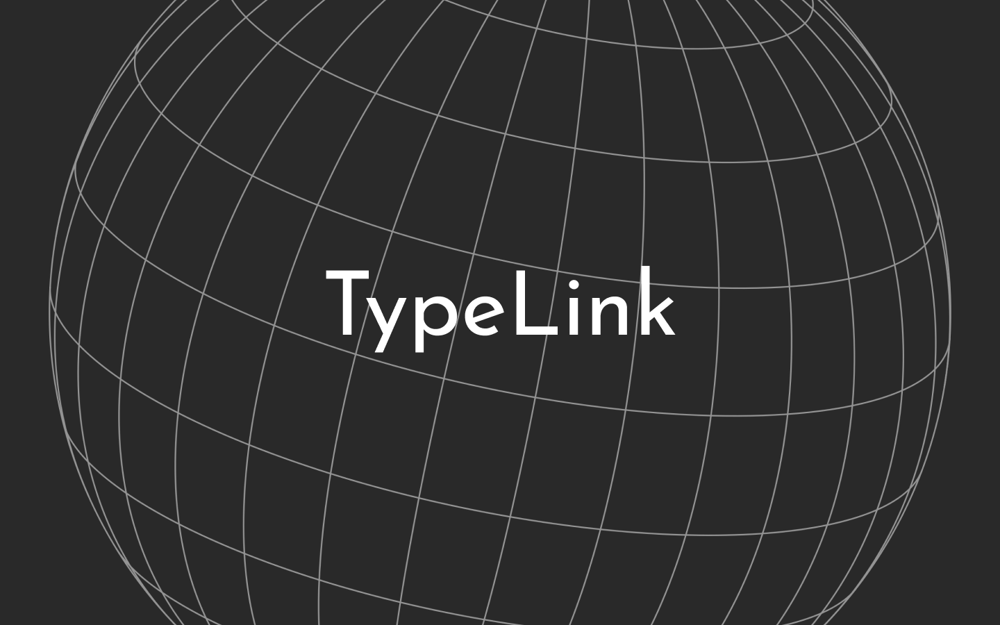

  

  <!-- github action -->

# 
A simple ~~multi-threaded & cross-platform~~ network library

## 📋 Table of Contents

Click to reveal

- [A simple ~~multi-threaded \& cross-platform~~ network library](#a-simple-multi-threaded--cross-platform-network-library)
  - [📋 Table of Contents](#-table-of-contents)
  - [🔍 About](#-about)
  - [💻 Requirements](#-requirements)
  - [🔧 Building](#-building)
    - [🔗 Link with CMake](#-link-with-cmake)
    - [🎮 Testing Branch](#-testing-branch)
  - [📝 Documentation](#-documentation)
  - [🏛️ Architecture](#️-architecture)
  - [⚠️ Bugs](#️-bugs)
  - [🤝 Authors](#-authors)

## 🔍 About

TypeLink is a simple ~~multi-threaded & cross-platform~~ network library, it is not yet finished and is still in development.

The following features are planned:
- [x] TCP
- [x] UDP
- [ ] Multithreading
- [ ] Cross-platform

The idea behind it is to be able to call a server or a client with a minimum of things to configure and to be able to use it quickly.
An example server/client is available on the `testing` branch.
This library has its origins in several school projects with the network as the main topic, so please bear with this library without much ambition.
If more and more improvements are proposed, I would put a PR / Issues Template 

## 💻 Requirements

Supported operating systems:
- [ ] Windows (untested)
- [x] Linux (tested on Ubuntu 22.04)
- [ ] MacOS (untested)

Dependencies:
- [Cmake](https://cmake.org/download/) 3.24+

## 🔧 Building

### 🔗 Link with CMake

### 🎮 Testing Branch

Go first to the `testing` branch, then:

Launch `typelink.sh` (linux/MacOS) or `typelink.bat` (Windows) to start the building of the project.
It will automatically:
- Build the `link_client` and `link_server` executables (.exe on Windows) using those libraries

To see an example of how to use the library, you can check the `TypeLink/Server/main.cpp` and `TypeLink/Client/main.cpp` files.

## 📝 Documentation

The documentation is not yet available, but it will be soon.

## 🏛️ Architecture

The architecture of the library is available in the form of a diagram using the [puml framework](https://plantuml.com/), the diagram file is updated and available [here](Assets/Arch/TypeLink.puml).

  

## ⚠️ Bugs

- Because of the select() function present to ensure the cross-platform more easily, the limit of users is fixed on the UNIX systems at 1024, the will here is not in the immediate future to look at how Windows works at the level of the "file descriptor" but to create a simple and cross-platform library.
If the need is felt, a PR will be welcome, or I will do it myself in the future if I am asked.
_I may have fixed the problem by changing some things in my code, however I've seen a lot of warnings about this problem, so I'll see if there is anything to do or not._

## 🤝 Authors

Made by [Pibé](https://github.com/Parumezan) 🐙
